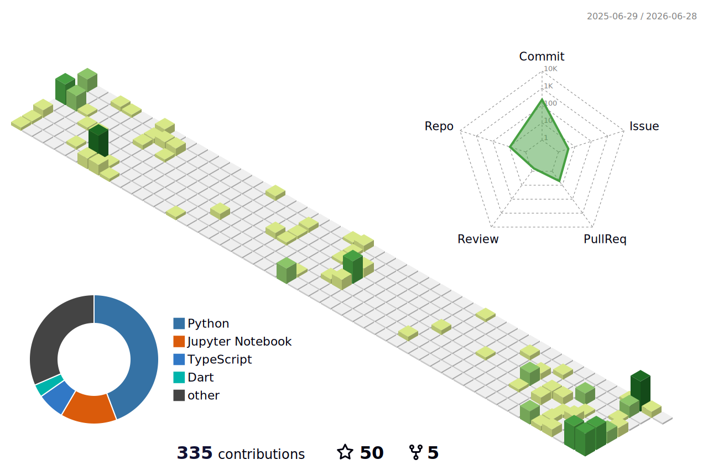

<h1 align="center">Hi There👋, I'm Abdallah Beshary</h1>

 

<h3 align="center"> How To Reach Me </h3>

<a href="https://www.linkedin.com/in/abdallahbeshary/" target="blank">
<a href="https://instagram.com/abdallah__beshary" target="blank">

  

<h3 align="left">&#128587 Brief <h3>

  
- 🌱 I’m currently learning **Different Technologies**

- 💬 Ask me about **Machine Learning , Data Science , Python**

- 📫 How to reach me **[Linkedin](https://www.linkedin.com/in/abdallahbeshary/)**

  

<h2 align="center"> Problem Solving </h2>

<a href="https://codeforces.com/profile/Boshaa1900" target="blank">
<a href="https://leetcode.com/u/Boshaa1900/" target="blank">
<a href="https://www.kaggle.com/abdallahbeshary" target="blank">

