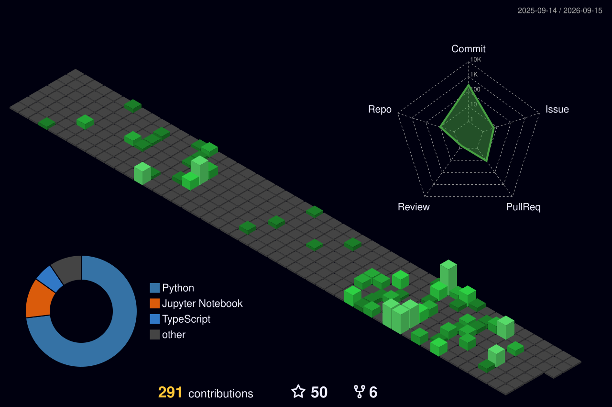

<h1 align="center">Hi There👋, I'm Abdallah Beshary</h1>
<div align="center">
 
</p>
</div>


```python
class Bosha:
    def __init__(self):
        self.name = "Abdallah Beshary"
        self.specialization = "AI Engineering"
        self.education = "B.Sc. Computer Science (Suez Canal University)"

    def my_skills(self) -> dict[str, list[str]]:
        return {
            "Languages": ["Python", "JavaScript", "Java", "C++"],
            "AI_ML": ["TensorFlow", "PyTorch", "Scikit-learn", "Computer Vision"],
            "Agentic_AI": ["LangChain", "CrewAI", "PydanticAI", "LlamaIndex"],
            "Deployment": ["FastAPI", "Docker", "Kubernetes"],
            "Databases": [ "FAISS", "ChromaDB", "Pinecone", "Qdrant", "MongoDB", "Postgres", "Supabase"],
        }

    def __str__(self) -> str:
        return f"{self.name} | {self.specialization} ({self.education})"
```


- 📫 How to reach me **[Linkedin](https://www.linkedin.com/in/abdallahbeshary/)**

<div id="header" align="center">
  
</div>

<!-- <h2 align="center"> Tech Stack </h2> -->


</p>





</div>
